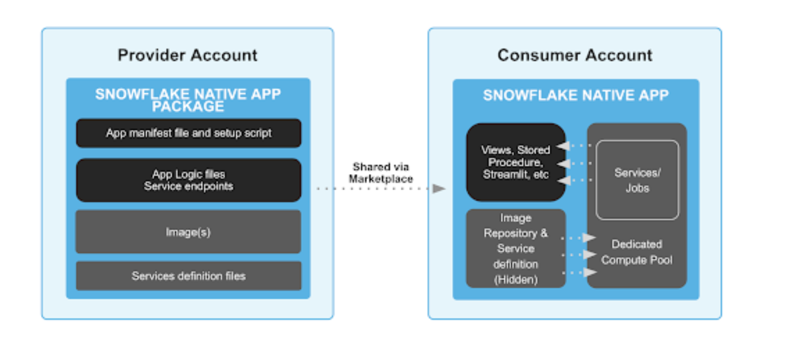

The core components of a Snowflake Native App with Snowpark Container Services are:

*Image repository:* Container image storage service to safely store and replicate content inside Snowflake


*Compute pool:* Collection of nodes available in a variety of different SKUs, dedicated to a given customer and to a single app 


*Service definition files:* Definition of service(s) with pointers to the container images in the registry and endpoint definitions


*Snowflake Native App Package:* Collection of all the content relevant to your app, which now includes container images


*Manifest file:* Definition of the app, its components, version info and configuration 


*Setup script:* Configuration script that installs the app in the consumer’s account, including compute pool setup 


In this section you will create an application package that will function as a container for the resources required by your application. You will perform the following tasks:

- Create an application package.

- Create a named stage within the application package.

## Create an Application Package
At its core, an application package is a Snowflake database that is extended to include additional information about an application. In that sense, it is a container for an application that includes:

- Shared data content
- Application files

To create an application package:

To grant the CREATE APPLICATION PACKAGE privilege to your role, run the following command:

```
use role accountadmin;
GRANT CREATE APPLICATION PACKAGE ON ACCOUNT TO ROLE accountadmin;
GRANT CREATE APPLICATION PACKAGE ON ACCOUNT TO ROLE test_role;
use role test_role;
```


*Note*
Although the ACCOUNTADMIN role has this privilege by default, to be able to create an application package, you must ensure that your role has been granted this privilege.

To create the application package, run the following command:

`CREATE APPLICATION PACKAGE workbench_na;`

*Note*
After running this command, the current context changes to workbench_na.

To verify the application package was successfully created, run the following command:`SHOW APPLICATION PACKAGES;`
You should see *workbench_na* in the name column of the output. Refer to SHOW APPLICATION PACKAGES for additional information on this command.

In this section you learned that an application package is a container for the resources used by an application. You also learned how to create an application package.

## Create a Named Stage
In this section you will create a named stage to store files required by the Native Apps Framework. A named stage is also required to store any external code files you want to include in your application. Uploading these files to a named stage makes them available when creating your application.

To create a named stage, do the following:

To set the context to the application package you created in the previous section, run the following command:

`USE APPLICATION PACKAGE workbench_na;`
To create the required schema for the named stage, run the following command:

`CREATE SCHEMA stage_content;`
To create the named stage, run the following command.

```
CREATE OR REPLACE STAGE workbench_na.stage_content.setup_stage
  FILE_FORMAT = (TYPE = 'csv' FIELD_DELIMITER = '|' SKIP_HEADER = 1);
```
This command creates the named stage in the database and schema you created in the previous steps.

*Note*
You must include FILE_FORMAT = (TYPE = 'CSV' FIELD_DELIMITER = '|' SKIP_HEADER = 1); as part of this command. These are not optional.

You now have a named stage within the application package where you can upload the files you will use to build your application.

*Note*

Although this tutorial uses a named stage within the application package, this is not a requirement. You can also use a named stage that exists in a database and schema outside the application package.


To upload application files, do one of the following:

- Upload the application files using Snowsight as described in Staging Files Using Snowsight
- Upload the application files using SnowSQL by running the following commands:

```
PUT file://native_application/manifest.yml @workbench_na.stage_content.setup_stage overwrite=true auto_compress=false;
PUT file://native_application/scripts/setup.sql @workbench_na.stage_content.setup_stage/scripts overwrite=true auto_compress=false;
PUT file://native_application/setup.md @workbench_na.stage_content.setup_stage overwrite=true auto_compress=false;
```
LIST @workbench_na.stage_content.setup_stage;

GRANT CREATE APPLICATION ON ACCOUNT TO ROLE test_role;
GRANT INSTALL ON APPLICATION PACKAGE workbench_na
  TO ROLE test_role;


CREATE APPLICATION workbench
  FROM APPLICATION PACKAGE workbench_na
  USING '@workbench_na.stage_content.setup_stage';

SHOW APPLICATIONS;