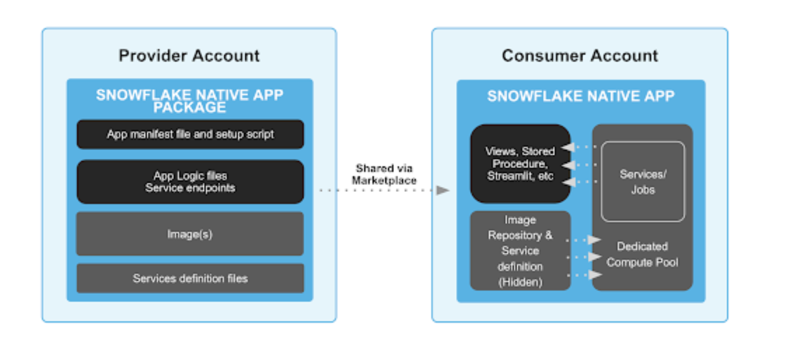

The core components of a Snowflake Native App with Snowpark Container Services are:

*Image repository:* Container image storage service to safely store and replicate content inside Snowflake

*Compute pool:* Collection of nodes available in a variety of different SKUs, dedicated to a given customer and to a single app 

*Service definition files:* Definition of service(s) with pointers to the container images in the registry and endpoint definitions

*Snowflake Native App Package:* Collection of all the content relevant to your app, which now includes container images

*Manifest file:* Definition of the app, its components, version info and configuration 

*Setup script:* Configuration script that installs the app in the consumer’s account, including compute pool setup 

## Create an Application Package
At its core, an application package is a Snowflake database & role all in one that is extended to include additional information about an application. In that sense, it is a container for an application that includes:

- Shared data content
- Application files

Our application includes:

setup.sh - shell script that uploads Docker images and creates an external security integration that our application will use

img folder - this holds our Docker images

pkg folder - this holds all the files for our application
- manifest.yaml
- setup.sql
- spec.yaml

producer.sql
- This is the configuration script for the creator of the application e.g. Posit
- This is where you will upload your app specs, images, create your application package, versions of your application package, etc

consumer.sql
- This is the configuration script for the consumer of the application e.g. Posit customer
- This is where you run the application, grant bind service endpoints, etc.
